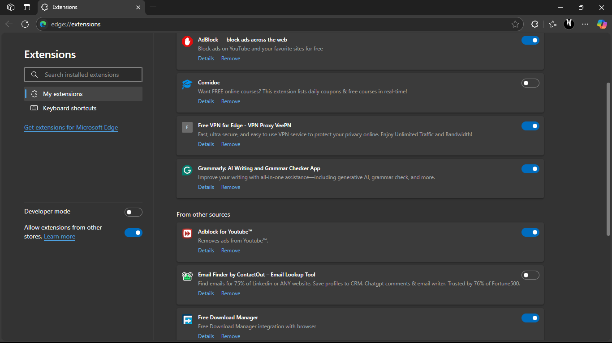
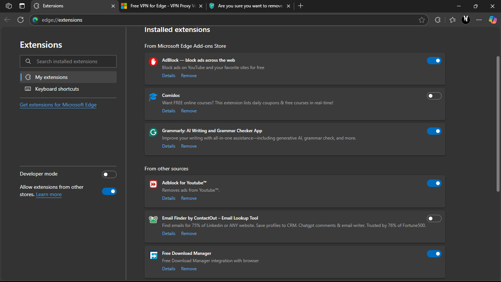

# Day 7: Identify and Remove Suspicious Browser Extensions

## 🎯 Objective
Learn to spot and remove potentially harmful browser extensions.

## 🧰 Tools Used
- Microsoft Edge (also applicable: Firefox)

## 📍 Steps Taken
1. Opened Extension Manager (`edge://extensions/`).
2. Reviewed all installed extensions.
3. Checked each extension's permissions, source, and reviews.
4. Identified suspicious or unused extensions.
5. Removed suspicious or unnecessary extensions.
6. Restarted browser to apply changes.
7. Observed improved browser performance.
8. Researched risks posed by malicious browser extensions.

## 🗑️ Removed Extensions

| Extension Name        | Reason for Removal                      |
|-----------------------|------------------------------------------|
| Free VPN for Edge     | Unknown source, excessive permissions    |
| WeatherWidgetFree     | Unused, installed with another app       |

## ✅ Kept Extensions
- Grammarly
- Ad Block
- Comidoc
- Adblock for Youtube

## 📸 Screenshots

### 🔹 Before Removal

### 🔹 After Cleanup

## 🧠 Learnings
- Malicious extensions can inject ads, trackers, or steal data.
- Some mimic trusted tools but contain spyware.
- Browser permissions can be misused to monitor all browsing activity.
- Regular extension audits are a must for browser security.
